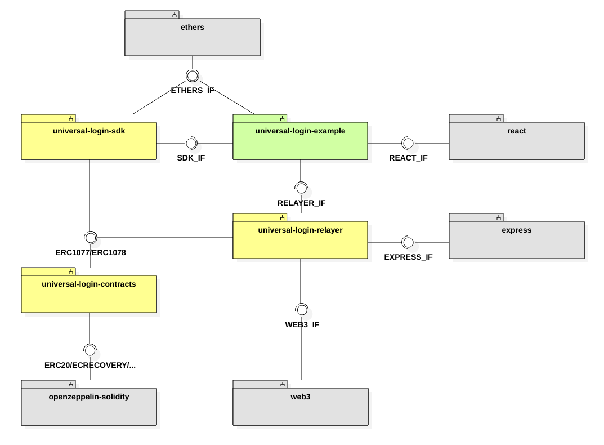

[](https://travis-ci.org/UniversalLogin/UniversalLoginSDK)

# Ethereum UniversalLoginSDK

UniversalLogin is a design pattern for storing funds and connecting to Ethereum applications, aiming to simplify new users on-boarding.

## Disclaimer

This is a work in progress. Expect breaking changes. The code has not been audited and therefore can not be considered secure.

## Technical concepts
Technically Universal Login utilizes four major concepts:
- Personal multi-sig wallet - a smart contract used to store personal funds. A user gets his wallet created in a bearly noticeable manner. The user then gets engaged incrementally to add authorization factors and recovery options.
- Meta-transactions - that give user ability to interact with his wallet from multiple devices easily, without a need to store ether on each of those devices. Meta-transactions, also allow paying for execution with tokens.
- ENS names - naming your wallet with easy-to-remember human-readable name
- Universal login - ability to use the wallet as authorization layer to numerous web applications dapps
-
## Structure
This repository is organised as monorepo.

- [Contracts](https://github.com/UniversalLogin/UniversalLoginSDK/tree/master/universal-login-contracts) - all contracts used in this project
- [Relayer](https://github.com/UniversalLogin/UniversalLoginSDK/blob/master/universal-login-relayer/README.md) - allows to interact with blockchain
- [SDK](https://github.com/UniversalLogin/UniversalLoginSDK/blob/master/universal-login-sdk/README.md) - easy way to communicate with relayer by http protocol
- [Example](https://github.com/UniversalLogin/UniversalLoginSDK/blob/master/universal-login-example/README.md) - example app, which shows how to use SDK

## Internal dependencies

The diagram below shows the internal dependencies among the Universal Login subsystems and the relevant external dependencies.



The *external* interfaces present in the Universal Login system are identified by the lollipop use symbol:

- _\<\<IF-6\>\>_ RELAYER HTTP JSON IF: this interface defines an off-chain remote API for ERC [#1077](https://github.com/ethereum/EIPs/pull/1077) and [#1078](https://github.com/ethereum/EIPs/pull/1078)
- _\<\<IF-9\>\>_ ETH JSON-RPC IF: this interface is the Ethereum JSON-RPC API for the on-chain execution

The *internal* interfaces defined within the Universal Login system are identified by the arrow use symbol. The main ones are:

- _\<\<IF-2\>\>_ UL SDK IF: the JS applications using Universal Login shall be based on this library interface to conveniently attach to the [Relayer](https://github.com/UniversalLogin/UniversalLoginSDK/blob/master/universal-login-relayer/README.md) subsystem and route their meta transactions
- _\<\<IF-4\>\>_ ERC1077 SIG IF: this interface is a message hash and signature JS facility API for ERC [#1077](https://github.com/ethereum/EIPs/pull/1077)
- _\<\<IF-5\>\>_ ERC1077 IF / ERC1078 IF: this interface is made up of ERC [#1077](https://github.com/ethereum/EIPs/pull/1077) and [#1078](https://github.com/ethereum/EIPs/pull/1078) smart contracts ABI


## Quick start

## Hacking
To start hacking around go to [tutorial](https://github.com/UniversalLogin/UniversalLoginSDK/blob/master/Tutorial.md).
To just see example in action follow the next section.

## Quick example start

Before running example, you have PostgreSQL installed, up and running.
You might want to check database configuration in file `universal-login-example/src/relayer/knexfile.js` and make sure your database is configured correctly.

To install dependencies and build projects run following commands from the main project directory:

```sh
yarn && yarn build
```

To run example:

```sh
cd universal-login-example
yarn dev:start [hostAddress]
```

with `hostAddress` being your machine address where the Universal Login service will be accessible via HTTP (default is `localhost`, only local browser will work).

[manual option](https://github.com/UniversalLogin/UniversalLoginSDK/blob/master/universal-login-example/README.md)


## Contributing

Contributions are always welcome, no matter how large or small. Before contributing, please read the [code of conduct](https://github.com/UniversalLogin/UniversalLoginSDK/blob/master/CODE_OF_CONDUCT.md) and [contribution policy](https://github.com/UniversalLogin/UniversalLoginSDK/blob/master/CONTRIBUTION.md).

Before you issue pull request:
* Make sure all tests and linters pass.
* Make sure you have test coverage for any new features.


## Running linting/tests

You can run lint via:

```sh
./script/lint.sh
```

You can run tests:

```sh
./scripts/test.sh
```

You can ran full clean:
```sh
./scripts/clean.sh
```

And you can emulate full CI process by:
```sh
yarn
./scripts/travis.sh
```

## License

Universal Login SDK is released under the [MIT License](https://opensource.org/licenses/MIT).
