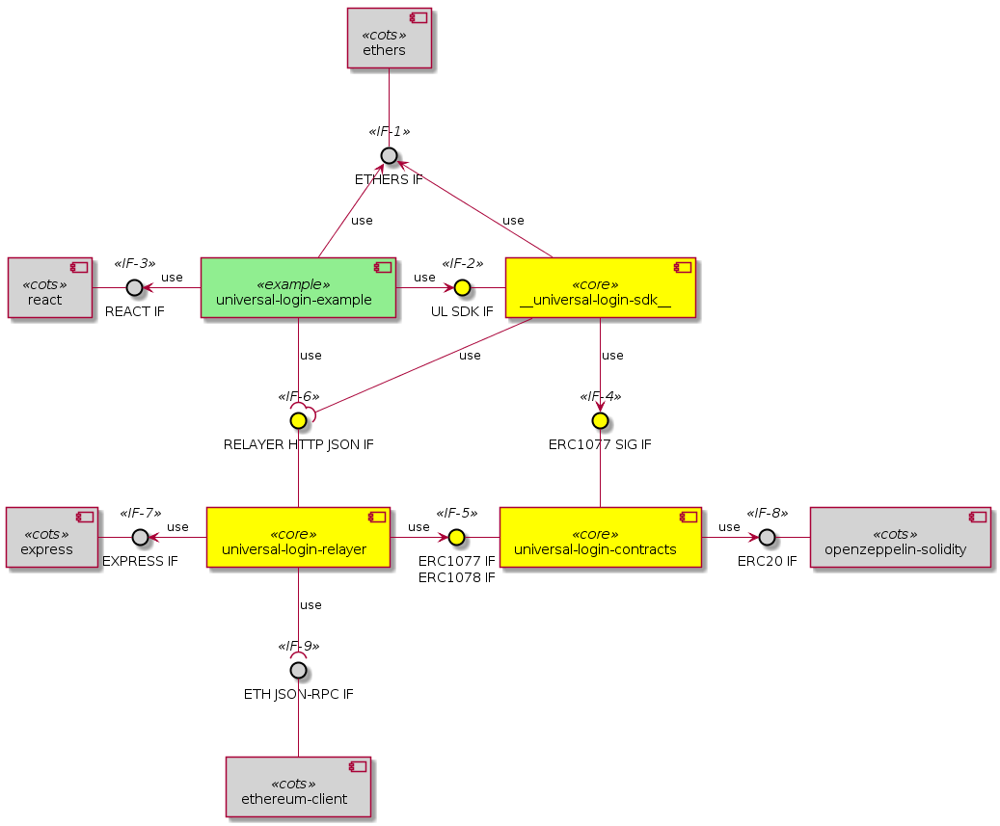
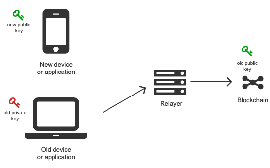
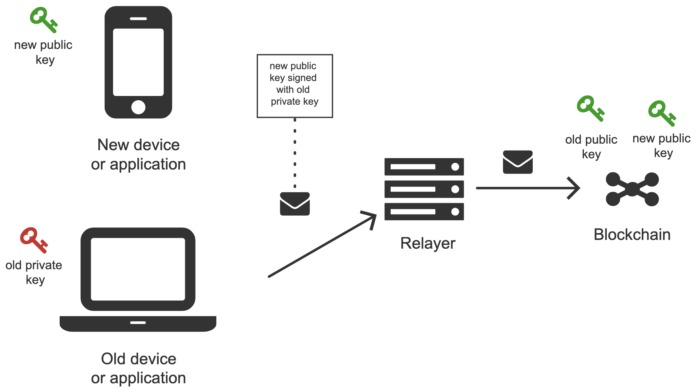
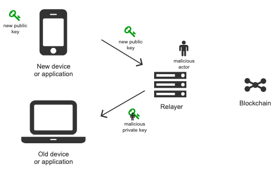
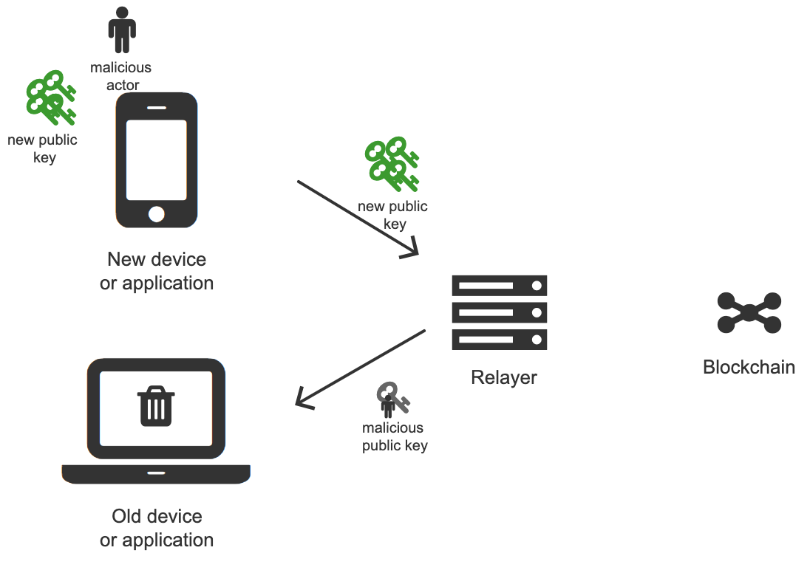
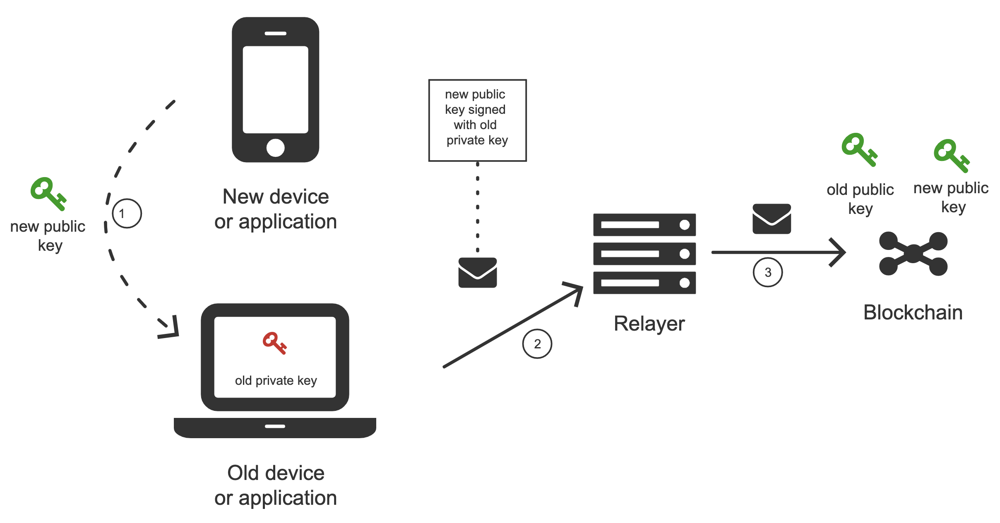
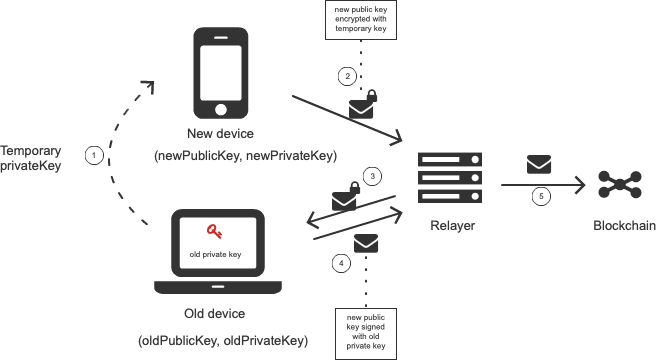
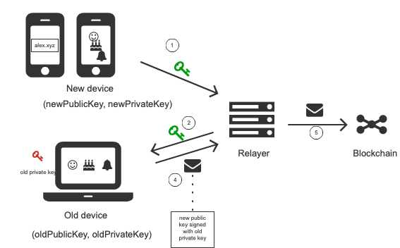

.. _overview:

Overview
========

.. _introduction:

Introduction
------------

Technical concepts
^^^^^^^^^^^^^^^^^^

Technically Universal Login utilizes four major concepts:

- **Personal multi-sig wallet** - a smart contract used to store personal funds. A user gets his wallet created in a barely noticeable manner. The user then gets engaged incrementally to add authorization factors and recovery options.
- **Meta-transactions** - that gives user ability to interact with the smart contract from multiple devices easily, without a need to store ether on each of those devices. Meta-transactions enable payments for execution with tokens.
- **ENS names** - naming your wallet with easy-to-remember human-readable name
- **Universal login** - wallet name can be used to log in to dapps, web, and native applications

Components
^^^^^^^^^^
Universal Login has three components. All components are stored in one monorepo `available here <https://github.com/universallogin>`_.
Components are listed below:

- `Contracts <https://github.com/UniversalLogin/UniversalLoginSDK/tree/master/universal-login-contracts>`_ - smart contracts used by Universal Login, along with some helper functions
- `Relayer <https://github.com/UniversalLogin/UniversalLoginSDK/tree/master/universal-login-relayer>`_ - HTTP REST server that relays meta-transactions to Universal Login smart contracts
- `SDK <https://github.com/UniversalLogin/UniversalLoginSDK/tree/master/universal-login-sdk>`_ - javascript API, a thin communication layer that interacts with the Universal Login ecosystem, via both relayer and Ethereum node.
- `React <https://github.com/UniversalLogin/UniversalLoginSDK/tree/master/universal-login-react>`_ - typescript library, that contains Universal Login main components to use in react applications.

Dependencies
^^^^^^^^^^^^
The diagram below shows dependencies between components.

The external interfaces present in the Universal Login system are identified by the lollipop use symbol:

<<IF-6>> RELAYER HTTP JSON IF
  this interface defines an off-chain remote API for ERC #1077 and #1078
<<IF-9>> ETH JSON-RPC IF
  this interface is the Ethereum JSON-RPC API for the on-chain execution

The internal interfaces defined within the Universal Login system are identified by the arrow use symbol. The main ones are:

<<IF-2>> UL SDK IF
  the JS applications using Universal Login shall be based on this library interface to conveniently attach to the Relayer subsystem and route their meta transactions
<<IF-4>> ERC1077 SIG IF
  this interface is a message hash and signature JS facility API for ERC #1077
<<IF-5>> ERC1077 IF / ERC1078 IF
  this interface is made up of ERC #1077 and #1078 smart contracts ABI

.. _main_concepts:

Main concepts
-------------

Deploy
^^^^^^

will be added soon

Meta-transactions
^^^^^^^^^^^^^^^^^

will be added soon

Connection new device
^^^^^^^^^^^^^^^^^^^^^

One of the key activities is connecting the newly created public key to the existing smart contract wallet. The new public key is created on a new device or application that never interacted with the smart contract wallet before. See below.

The new public key is added using meta-transaction. Meta-transaction needs to be signed with the private key from a device that already is authorized in the wallet smart contract. After signing, meta-transaction is sent to the relayer, which propagates it to the blockchain. Below picture shows this process.

There are four key actors in the process:

- **Old device** or application that is already authorized. Authorized means there is a public and private key pair, where the private key is stored on the device and public key is in the wallet smart contract on the blockchain.
- **New device** (or new application) that we want to authorize to use wallet smart contract. To do that we need to generate **new key pair** (new public key and private key) and add the new public key to wallet contract as management or action key. Adding key is creating meta-transaction signed by the old device (old private key) and sending to relayer.
- **Relayer** - relays meta-transaction sent from an old device to blockchain
- **Smart Contract Wallet** - smart contract that stores keys and executes meta-transactions.

**Possible attacks**

The problem might seem pretty straightforward, but there are some complexities to consider. In particular, we should avoid introducing the possibility of the following attacks:

* Man in the middle

A man-in-the-middle attack can happen when a new device sends the new public key to the old device. A malicious actor that intercepts communication (e.g. relayer) can switch new public key with its new public key and as a result, can take over control of the wallet contract.

* Spamming

Spam attack can happen when a lot of new devices request connect to an old device, therefore the old device is spamming with many notifications.

**Solution 1**

The first solution is pretty straightforward. New device transfers it's public key to the old device.

**Transfer means**

There are two possible ways of transferring the public key.

Note: this is a public key, so we don't worry about intercepting.
Note: The seed for ecliptic curve key that we use has 128bits or 16 bytes.

* Scan the QR code
* Manually copy public key by typing. That might have different shades.

  * Retype the letters (32 chars if hex or 26 with just mix cased letters + digits).
  * Use emojis (12 emojis with 1000 emoji base), see example interface below.

  .. image:: static/connect/emoji.png

  * If both applications are on the some on one device -> copy paste. (or in some cases even send by e-mail)

**Solution 2**

The second solution might be useful if, for some reason, we want to transfer information from the old device to the new device. That might make a difference in the case of using QR codes and old device does not possess a camera.

The process goes as follows:

1. The old device generates a temporary key pair.

2. The private key gets transferred to the new device.

3. The new device encrypts a new public key using a temporary private key.

4. The old device sends meta-transaction via relayer to the wallet smart contract.

5. On successful decryption, the old device sends meta-transaction to relayer to add the new public key to wallet smart contract.

**Solution 3**

The third solution is an alternative to previous solutions. The new device generates a new key pair and shows to user emojis based on a hash of the new public key to later use on an old device. The newly generated public key is sent to the relayer and forwarded to the old device. To finalize connecting a new device, the user has to arrange emojis in the exact order. See below.

In the case of spamming, the user has to type exact emojis unlike arranging.

.. _development: 

Development
-----------

Development environment
^^^^^^^^^^^^^^^^^^^^^^^
Summary
  Development environment helps quickly develop and test applications using universal login.
  The script that starts development environment can be run from ``@universal-login/ops`` project.
  The script does a bunch of helpful things:

  - creates a mock blockchain (ganache)
  - deploys mock ENS
  - registers three testing ENS domains: ``mylogin.eth``, ``universal-id.eth``, ``popularapp.eth``
  - deploys example ERC20 Token that can be used to pay for transactions
  - creates a database for a relayer
  - starts local relayer

For more go to :ref:`tutorial<development_environment>`

